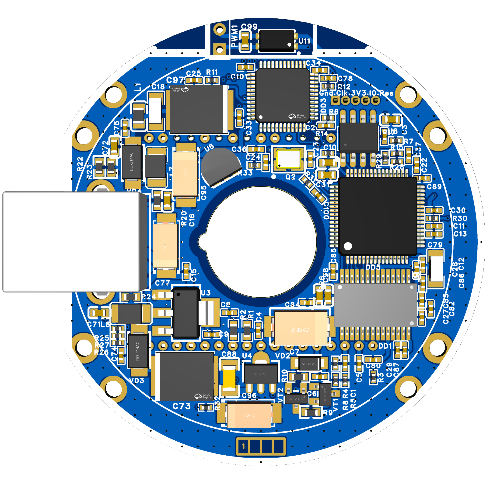

<!-- zurp-readme-header:begin — paste this block once, never again: the poster and the badges update themselves at each build of the site — do not edit it -->
<div align="center">

<a href="https://zurp-astronomics.github.io/maelstrom/"></a>


</div>

<!-- zurp-readme-header:end -->
# Maelstrom — caméra APS-C refroidie

> ## ⚠ Work in Progress — NOT VALIDATED — don't build it ⚠
>
> **Commit préliminaire, rien n'est validé.** Ne fabriquez pas cette caméra en l'état.

**Maelstrom** (ex-**Cam87 Redux**) : un capteur APS-C dans le corps d'une caméra planétaire ZWO.

Projet OSHWlab : https://oshwlab.com/lordzurp/cam87_redux



## La base

La Cam87, c'est un projet ukrainien du turfu pour faire une caméra astro refroidie à partir d'un
capteur de Nikon D40 : APS-C, 6 Mpx, pixels de 7,8 µm. C'est le même capteur que dans la QHY 8Pro
([fiche technique](https://www.astroshop.de/fr/cameras-astronomiques/camera-qhy-8-pro-color/p,54748#specifications)).

J'ai déjà une version « box » fonctionnelle, donc on part d'un projet déjà validé. Mais la mécanique
était à revoir : 3 PCB à assembler, boîtier imprimé fragile…

## Le projet

Rentrer ce truc dans le boîtier d'une caméra planétaire ZWO. J'ai un boîtier d'ASI224 vide
(électronique fumée) : techniquement, ça doit passer !

## Mises à jour du schéma

- refonte de la partie refroidissement : opto-coupleur et MOSFET isolés du reste du PCB ;
- ajout de capas de découplage un peu partout ;
- reprise de la BOM pour optimiser le coût et le placement (→ 0402…) ;
- retour sur une EEPROM standard (merci la dispo).

## PCB

- rond, 56 mm de diamètre ;
- zone de composants de 48,5 mm (rebord interne du boîtier) ;
- séparation au maximum des parties alim, ADC, pilotage CCD H et V, logique ;
- découplage des alims aux petits oignons, des capas partout où il y a un trou ;
- connecteur USB type B.

Les fichiers des deux cartes (v1.1) sont dans [`1_Board/`](1_Board/) : carte logique et carte
d'alimentation.

## Version alternative

Une variante est envisagée, **sans aucun fichier dans ce dépôt** à ce jour :

- ronde, 48,5 mm de diamètre ;
- connecteur USB-C ;
- pas de MOSFET, juste l'opto pour le refroidissement.

## Fabrication

Pour 5 cartes, c'est 160 €, donc environ 200 € au final, soit environ 40 € pièce.

## Arborescence

- [`0_Datasheets/`](0_Datasheets/) : datasheets des composants — AD9826, CXD1267, EL7457, FT2232H,
  MC34063 (avec sa feuille de calcul `.XLS`), STM32F103, TPS763, 93C46/CAV93C46, AN920, brochage de
  l'ICX453.
- [`1_Board/`](1_Board/) : les deux cartes électroniques v1.1, chacune avec son schéma, ses vues 2D
  et 3D, son modèle STEP, ses Gerber, sa BOM et son fichier de placement (PnP).
  - [`Logic_board/`](1_Board/Logic_board/) : la carte logique ;
  - [`Power_board/`](1_Board/Power_board/) : la carte d'alimentation.
- [`2_Hardware/`](2_Hardware/) : la mécanique — cold plate (noyau et plaque du dessous, dessus avec
  son plan PDF) et radiateur, en STEP.
- [`3_3D-Models/`](3_3D-Models/) : modèles 3D — le modèle Fusion 360 `Maelstrom_Camera.f3d`, le STEP
  `Maelstrom_Camera.step`, et le modèle 3D de la carte d'alimentation du 2024-03-09.
- [`4_Firmware/`](4_Firmware/) : `cam87 v1.0.bin`, le firmware binaire STM32 de la cam87, et
  `cam87.ept`, le gabarit MProg de l'EEPROM du FT2232H.
- [`5_App/`](5_App/) : les logiciels Windows, chacun dans son dossier d'origine, à garder groupé
  (l'exécutable charge sa DLL et ses fichiers à côté de lui).
  - [`MProg 3.5 Release/`](5_App/MProg%203.5%20Release/) : MProg de FTDI, pour programmer l'EEPROM
    du FT2232H ;
  - [`Viewer/`](5_App/Viewer/) : le viewer de la cam87 (`viewer cam87.exe`, sa `ftd2xx.dll` et
    `cam87.xml`).
- [`8_References/`](8_References/) : documents des caméras d'origine — schémas de la CAM86 et de la
  cam87, images de la QHY8pro.
- [`9_Assets/`](9_Assets/) : la vitrine du site zUrp (affiche et fiche `zurp.yml`).

### Nommage des fichiers de conception

Les fichiers conçus par le projet (dans `1_Board/`, `2_Hardware/` et `3_3D-Models/`) suivent le
schéma :

```
Maelstrom_<Pièce>[_<version ou date>][_<rang>_<document>].<ext>
```

- `<Pièce>` : la carte ou la pièce, sans espace ni `_` — `LogicBoard`, `PowerBoard`,
  `ColdPlate-BotCore`, `ColdPlate-BotPlate`, `ColdPlate-Top`, `Heatsink`, `Camera` ;
- `<version ou date>` : quand le fichier en a une — `v1.1`, `2024-03-09` ;
- `<rang>_<document>` : pour les cartes, le rang du document dans le dossier de fabrication —
  `1_schematics`, `2_2D-view_top`, `2_3D-view_bot`, `2_3D-view`, `3_gerber`, `4_BOM`, `5_PnP`.

Exemple : `Maelstrom_LogicBoard_v1.1_3_gerber.zip`.

Les fichiers de tiers (datasheets, documents de référence, firmware, MProg, viewer) gardent leur
nom d'origine.

## Licence

Ce que le projet a conçu est sous **GPL-3.0** (voir [`LICENSE`](LICENSE)).

Exceptions, qui gardent leur propre licence :

- les datasheets de `0_Datasheets/` et les documents de `8_References/` restent la propriété de
  leurs auteurs ;
- MProg et ses DLL (`5_App/MProg 3.5 Release/`) sont sous la licence de FTDI
  (`EULA.txt` dans son dossier) ;
- le viewer (`5_App/Viewer/viewer cam87.exe`, `cam87.xml`) et le firmware `4_Firmware/cam87 v1.0.bin`
  viennent de la cam87 de grim (Gilmanov Rim), publiés sans licence ; la `ftd2xx.dll` qui
  accompagne le viewer est la DLL D2XX de FTDI ;
- `4_Firmware/cam87.ept` : gabarit MProg de l'EEPROM FT2232H de la cam87, d'**origine inconnue**,
  sans licence connue.
