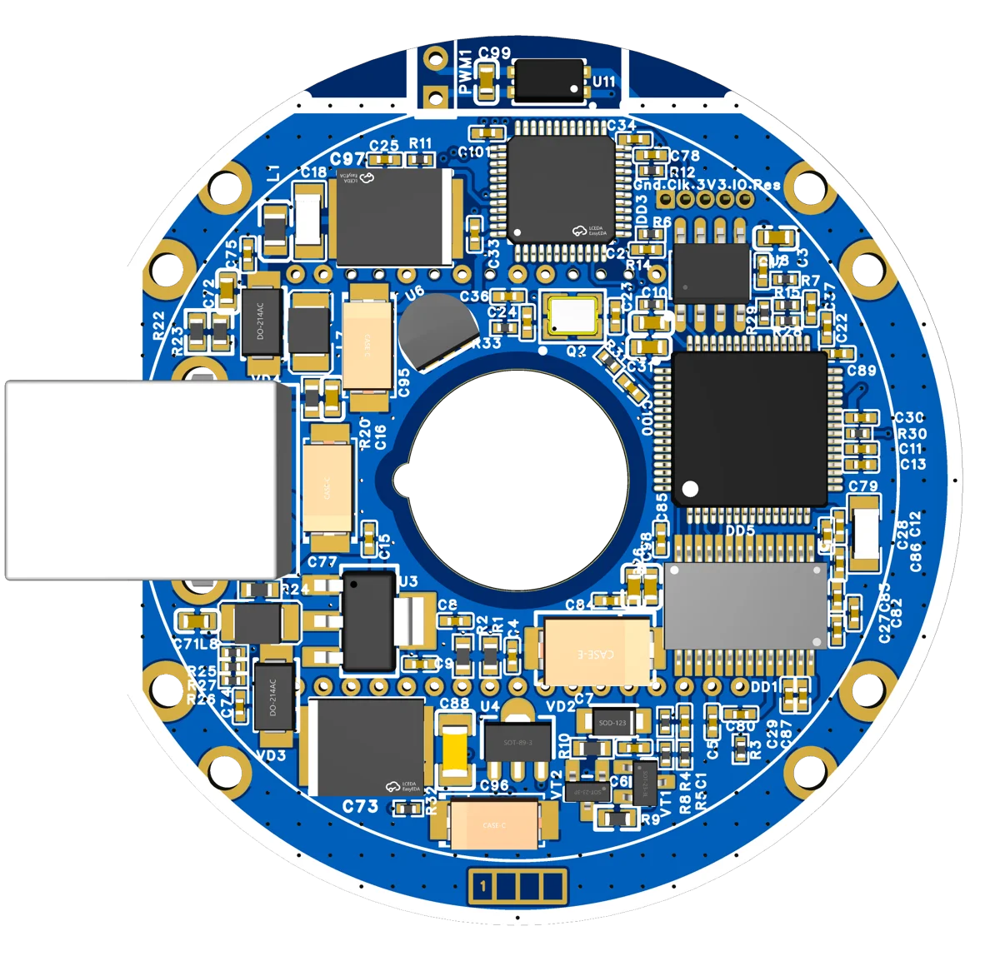

<!-- zurp-readme-header:begin — paste this block once, never again: the poster and the badges update themselves at each build of the site — do not edit it -->

<!-- zurp-readme-header:end -->

<h1 align="center">Maelstrom</h1>

<strong><em>Pull the sky in</em></strong>

  <a href="https://zurp-astronomics.github.io/maelstrom/">Website</a> ·
  <a href="../../releases">Releases</a> ·
  <a href="https://github.com/zUrp-Astronomics">zUrp Astronomics</a>

---

## 🚧 Work in progress — do not build yet 🚧

**Nothing here is validated on real hardware.** 
Files change without notice, and what you build today may need rework tomorrow. 
👀 Watch the repository to know when the first release lands.

---

## Why Maelstrom?

A cooled APS-C CCD astrocam usually costs more than a new CMOS camera. **Maelstrom cannibalises a
2006 DSLR instead**: the CCD of a Nikon D40 — APS-C, 6 Mpx, 7.8 µm pixels, the very sensor of the
QHY8 Pro — reborn behind active TEC cooling and a 16-bit readout chain, and headed for the body of
a ZWO planetary camera. Around **€40 per board**. Do the electronics yourself, and pull the sky in.

## At a glance

| | |
|---|---|
| Sensor | Nikon D40 CCD (Sony ICX453): APS-C, 6 Mpx, 7.8 µm pixels — same as the [QHY8 Pro](https://www.astroshop.de/fr/cameras-astronomiques/camera-qhy-8-pro-color/p,54748#specifications) |
| Readout | AD9826 16-bit ADC, FT2232H USB bridge, STM32F103 |
| Cooling | active TEC, opto-coupler and MOSFET isolated from the rest of the board |
| Boards | logic and power, v1.1 — round, 56 mm, components inside 48.5 mm |
| Link | USB type-B |
| Target body | the housing of a ZWO ASI224 planetary camera |
| Cost | 5 boards for €160 of fabrication, about €200 all in — around €40 each |

## Hardware

Maelstrom — formerly *Cam87 Redux* — starts from a design that already works: the author runs a
functional "box" version of the cam87. What it changes is the mechanics: three boards to assemble and
a fragile printed case become two round boards meant to fit the housing of a ZWO ASI224 — on
paper, it fits.

- **Layout.** Power, ADC, CCD horizontal and vertical drive and logic are kept as far apart as the
  56 mm allow; the supplies are decoupled with care, a capacitor wherever there was room.
- **Schematic updates.** Cooling redesigned around an isolated opto-coupler and MOSFET; decoupling
  added throughout; BoM reworked for cost and placement (down to 0402); back to a standard EEPROM.
- **Files.** Both v1.1 boards — logic and power — are in `1_Board/`; the cold plate, heatsink and
  camera design are in `2_Hardware/`. The source project is on
  [OSHWLab](https://oshwlab.com/lordzurp/cam87_redux).

## Status & roadmap

A variant is considered, with no file in this repository yet: a 48.5 mm round board, USB-C, and an
opto-coupler alone for the cooling, without the MOSFET.

## Credits

Maelstrom stands on the CAM86 and cam87 projects, which
pioneered the DSLR-sensor-reborn-as-astrocam approach; the cam87 is grim's (Gilmanov Rim).

## Repository layout

| Folder | Contents |
|---|---|
| [`0_Datasheets/`](0_Datasheets/) | datasheets of the components, as published by their makers |
| [`1_Board/`](1_Board/) | manufacturing files of the two v1.1 boards, one subfolder each: `Logic-board/`, `Power-board/` |
| [`2_Hardware/`](2_Hardware/) | mechanics: cold plate, heatsink, and the camera's design source (Fusion 360, STEP) |
| [`4_Firmware/`](4_Firmware/) | the cam87 STM32 firmware binary and the MProg template of the FT2232H EEPROM |
| [`5_App/`](5_App/) | Windows tools: FTDI MProg, and the cam87 viewer |
| [`8_References/`](8_References/) | external references: CAM86 and cam87 schematics, QHY8 Pro pictures |
| [`9_Assets/`](9_Assets/) | the showcase: product sheet, poster and README images |

## License

- **Hardware design** — boards, mechanics and 3D models: [Open Community License v1.1](LICENSE-HARDWARE).
- **Everything else** — firmware, software, documentation and images: [GNU GPL v3.0](LICENSE).

Third-party material keeps its own licence:

- the datasheets in `0_Datasheets/` and the documents in `8_References/` belong to their authors;
- MProg and its DLLs (`5_App/MProg 3.5 Release/`) are under FTDI's licence (`EULA.txt` in their folder);
- the viewer (`5_App/Viewer/`) and the firmware `4_Firmware/cam87 v1.0.bin` come from grim's (Gilmanov Rim) cam87, published without a licence; the `ftd2xx.dll` next to the viewer is FTDI's D2XX DLL;
- `4_Firmware/cam87.ept`, the MProg template of the cam87's FT2232H EEPROM, comes from the cam87 forums — most likely astroclub.kiev.ua, where grim's project was born (probable, not confirmed) — with no known licence.

---

<a href="https://zurp-astronomics.github.io/">zUrp Astronomics</a> — a subsidiary of zUrp Industries. Because buying is cheating.

